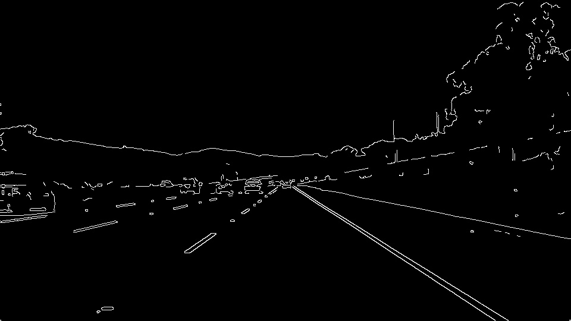
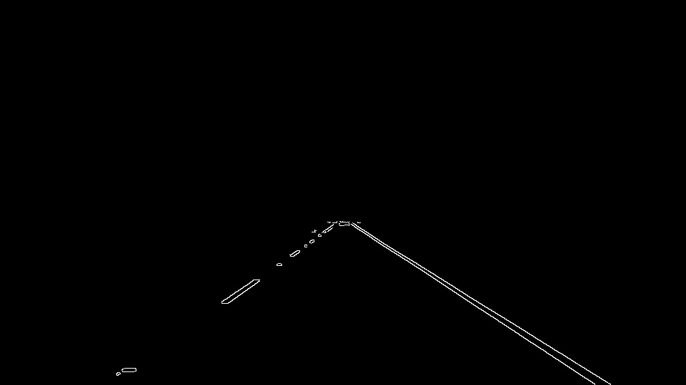

# **Finding Lane Lines on the Road** 

**Finding Lane Lines on the Road**

Overview
---

When we drive, we use our eyes to decide where to go.  The lines on the road that show us where the lanes are act as our constant reference for where to steer the vehicle.  Naturally, one of the first things we would like to do in developing a self-driving car is to automatically detect lane lines using an algorithm.

In this project we developed a pipeline to detect lane line in images using Python and OpenCV.  OpenCV means "Open-Source Computer Vision", which is a package that has many useful tools for analyzing images. The goal is to annotate the left and right lanes in a video. The steps to achieve the goal on an image are the following: (For video the same pipeline works)

1. Convert the image to grayscale 

2. Apply Gaussian smoothing 

3. Detect Cunny edge detection

4. Select the region of interest where the lanes are more likely to be found

5. Apply Hough line detection to find lane lines in the region of interest

---

### Reflection

The algorithm used to detect lane line in this project is very simple but it is not robust. Though for the provided videos the algorithm detects the lane lines successfully, it will not be able to do so from any videos.

### 1. Pipeline Description

My pipeline consisted of 5 steps. First, I converted the images to grayscale, then I apply Gaussing smoothing to to the gray image in order to reduce image noise and reduce details. The amount of smoothing is dependent on one parameter which is the kernel\_size of the Gaussian filter. The bigger the kernel\_size, the smoother/blurrier the image. I have used `kernel_size = 3`. Cunny edge detection is applied on top of the blurred image obtained from the previous step to find edges in the image. Cunny edge detection algorithm has two parameters: low\_threshold and high\_threshold. The algorithm first detects strong edge (strong gradient) pixels above the high\_threshold, and rejects pixels below the low\_threshold. Next, pixels with values between the low_threshold and high\_threshold are included as long as they are connected to strong edges. The output is a binary image with white pixels tracing out the detected edges and black everywhere else. I used `low_threshold = 100, high_threshold = 150`. Next I find the region of interest (ROI) from the edge image. To find the ROI, I make an assumption. I assume that the front facing camera that took the image is mounted in a fixed position on the car, such that the lane lines will always appear in the same general region of the image. This criterion will discard all the edges from the image which are less likely to be a lane and only pixels for lane detection in the region where we expect to find the lane lines can be considered. To select the ROI, I need a mask. This mask can be of any shape, triangular, quadrilateral. In fact, any polygon can be used. I have used a quadrilateral and that introduced four more parameters, the four vertices. Finally, we apply Hough Transform in edge detected image with ROI. 

`lines = cv2.HoughLinesP(edges, rho, theta, threshold, np.array([]), min_line_length, max_line_gap)`

Hough Transform takes several parameters to decide lines. Firstly, rho and theta are the distance and angular resolution of the grid in Hough space. In Hough space, we have a grid laid out along the (Θ, ρ) axis. We need to specify rho in units of pixels and theta in units of radians. The threshold parameter specifies the minimum number of votes (intersections in a given grid cell) a candidate line needs to have to make it into the output. min\_line\_length is the minimum length of a line (in pixels) that is accepted in the output, and max\_line\_gap is the maximum distance (again, in pixels) between segments that is allowed to be connected into a single line. In my algorithm, I chose `rho = 2, theta = pi/180, threshold = 20, min_line_length = 20, max_line_gap = 250`. The Hough Transform finds out all the possible lines from the edge image, but we want only two lines to identify the left and the right lane marking.

In order to draw a single line on the left and right lanes, I modified the draw_lines() function.  In the modified version, I separated the left and the right lanes by computing the slope from each line. As the origin of the image is the top left corner, all lines with positive slopes are left lane candidates and all lines with negative slopes are the right lane candidates. I also find the intercept for each line. By averaging the slopes and intercepts for both lanes I drew the final lane lines.

This pipeline succesfully detected the lane lines from solidWhiteRight.mp4 and solidYellowLeft.mp4 video. But for challenge.mp4 it did not work well. As we can see that there are many parameters that can effect the final output and a more eshaustive search of the parameter space can improve the results.   
 
The grayscale and the image after Gausssian smoothing is shown below:

  

The above image after Cunny edge detection and region select is shown below:

  

Here is the final output:

### 2. Potential shortcomings with current pipeline

The above mentioned algorithm will not generalize well with all kinds of video recorded from a car. Finding the right combination of parameters are important and there is no evaluation method to find out which one is actually the optimum. In reality videos vary a lot due to brightness, weather condition, shade, camera postition, occlusion, absense of a real lane mark and many other factors. The above mentioned algorithm will fail in  such cases.

Another shortcoming could be due to the curving and bending of a road. I am trying to detect a straight line in the region of interest which will definitely not work when there is a curve. Not to forget the situation when the road goes up and down, making the lane invisible.

Also, because of the region masking the algorithm will fail to detect lane lines while the car is changing the lane.

### 3. Possible improvements to the current pipeline

In video processsing a possible improvement would be to use some kind of tracking. Two consecutive frames do not vary a lot. So if we can pass the information such as slope, intercept and coordiates of both lines from the previous frame to the next frame that could certainly improve the overall performance of the algorithm. Also fitting a curve instead of a straight line might improve the accuracy.

Another potential improvement could be to reshape the video frame size to a specific size and then process the images to find the lane lines. That will make the parameters values we choose, applicable to any videos. But one of the best way would be to not choose the parameters manually and try to learn the parameters using machine learning approach. 

